# Lab 2 - Visualize ESP32 Telemetry on Azure

## 1. Prerequisites:
- Completed [Lab1 - Connect ESP32 Devkit using Azure IoT Middleware for FreeRTOS](Lab1.md). If you haven't, please do so.
- Azure Susbscription
- Azure IoT Hub: created in Lab1

## 2. Routing messages to Azure Blob Storage

In this lab, we will route the telemetry data from ESP32 to the Azure Blob Storage.

### 2.1 Set up an Azure Storage Account

Login to your Azure Portal, click `+ Create a resource`, enter `Storage account`, then click `Create`. 

Follow below settings to create a new storage account. Try to use the `existing Resource Group` and same region where you created the IoT Hub in Lab 1. 

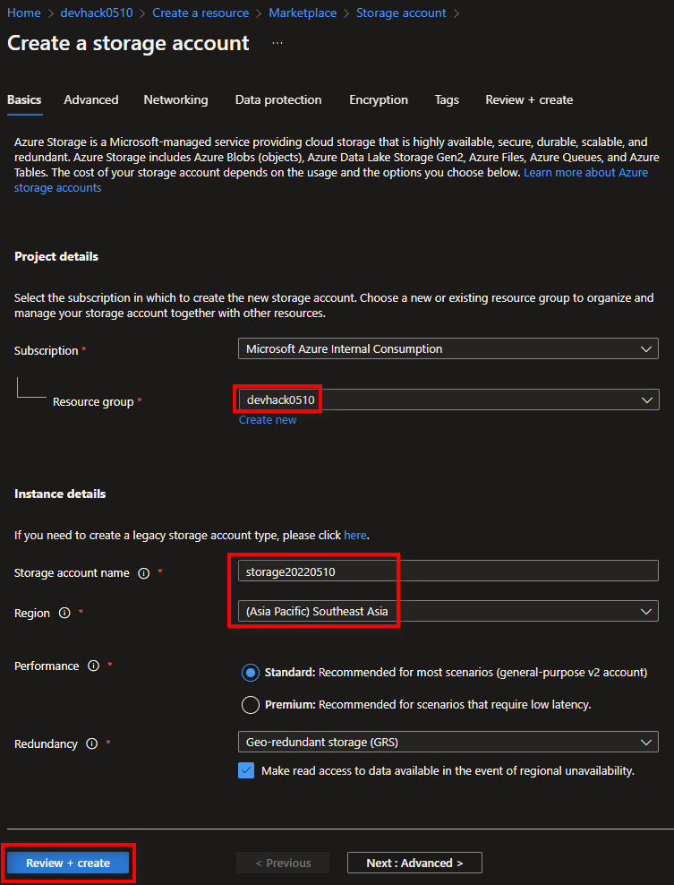

Click `Review and create`.

Once the depoayment is complete, click `Go to resource`.

On Storage account blade, click `Data storage` -> `Containers` -> `+ Container`. Enter a name for the New container, and then click `Create`.

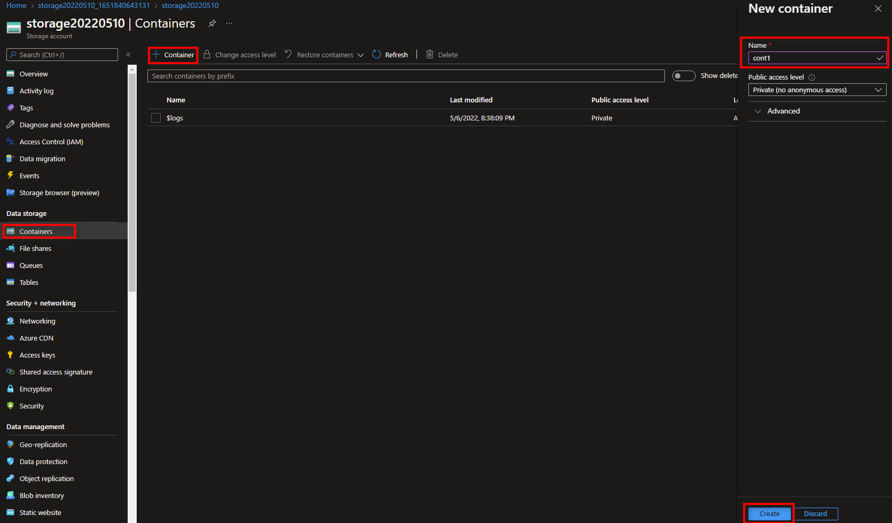

Once created, you should see the container listed.

## 2.2 Set up routing endpoints

From Azure Portal, navigate to Azure IoT Hub you created in Lab 1. 

Click `Messaging` -> `Message routing` -> `Custom endpoints` -> `+ Add`.

On `Add a storage endpoint` blade, enter `Endpoint name`, and then `Pick a container` -> Select the container created earlier -> click `Create`.

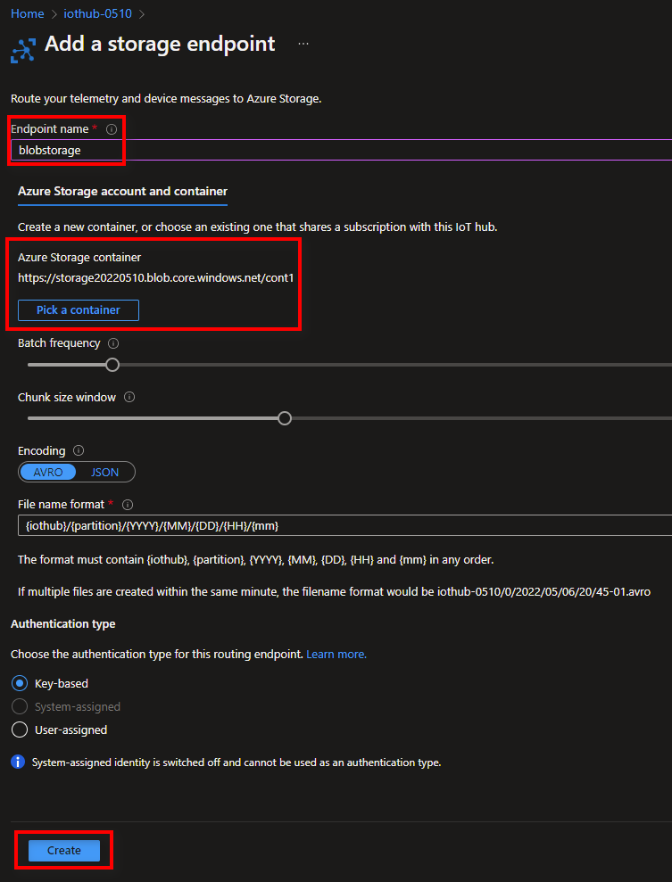

## 2.3 Set up routing endpoints

Click `Routes` -> `+ Add`.

Follow below screenshot to `Add a route`.

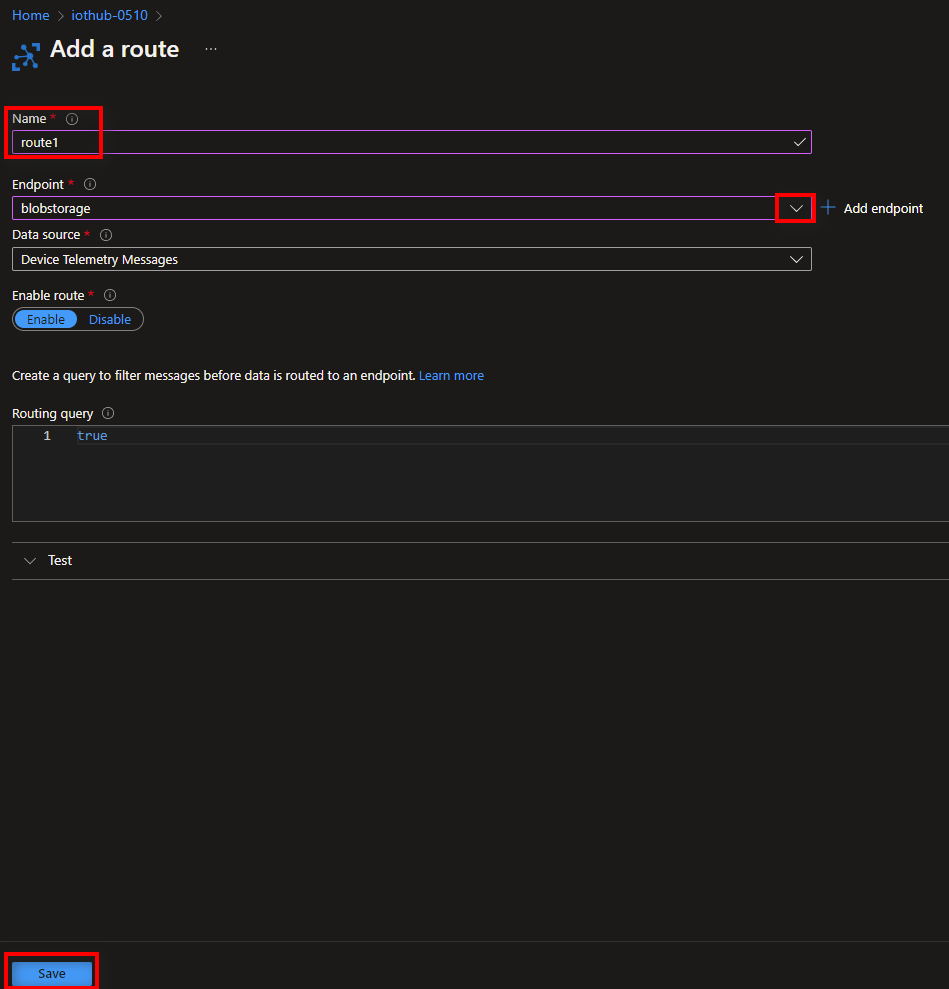

## 2.4 View the routed messages

Navigate to `Storage account` blade -> `Data storage -> Containers` -> click container created earlier `cont1`. You may see a folder like this.

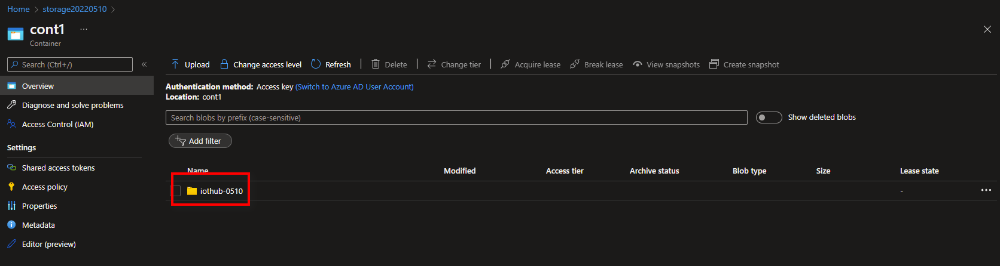

Keep clicking folder name to the blob level. You will see a few blobs created as below.

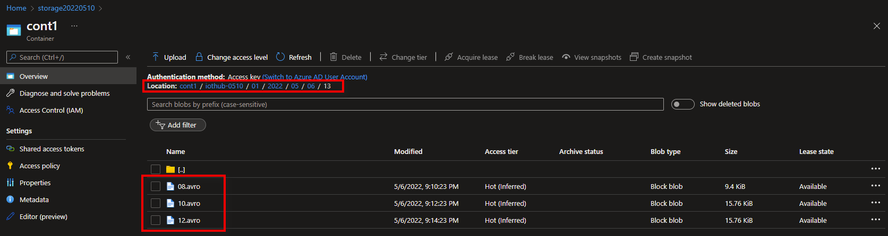

Try to download one of the blobs to local. 

View the downloaded .avro file in a text editor, ideally in VS Code. 

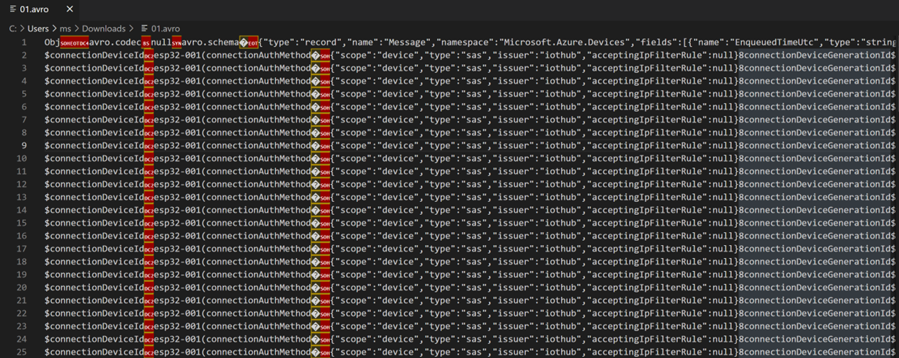

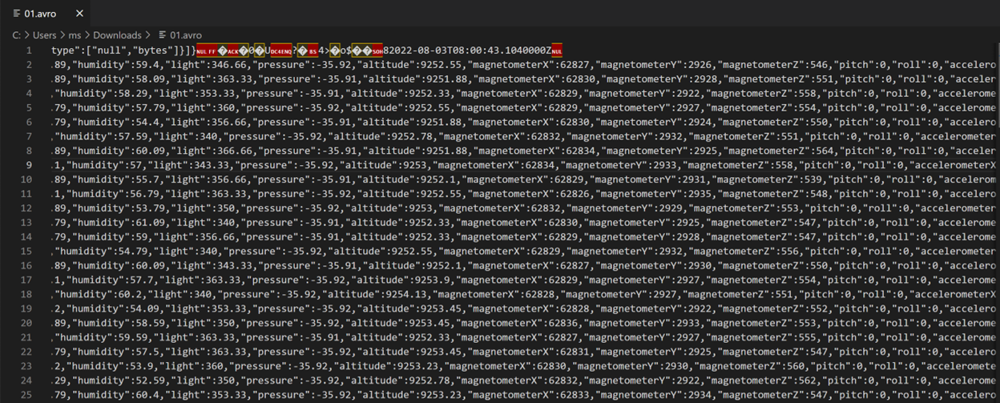

## 3. Visualize telemetry in Time Series Insight

### 3.1. Route telemetry to Event Hub

#### 3.1.1 Create an Event Hub Namespace

Go back to Azure Portal. Click `+ Create a resource` -> Search `Event Hubs` -> Click `Create`.

On `Create Namespace` blade, Select existing `Resource Group`, enter a `Namespace name` -> Location: `Southeast Asia` -> Pricing tier: `Standard` -> `Review + create`.

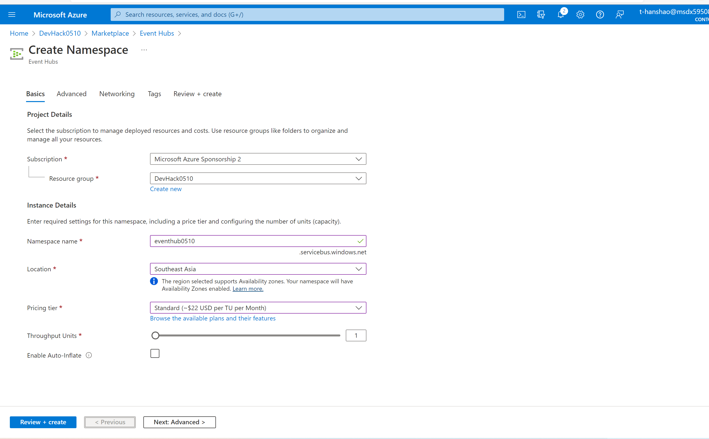

Once deployment is complete, click `Go to resource` to the `Event Hubs Namespace` page. This process may have to wait for a long time.

#### 3.1.2 Create an Event Hub Instance

Click `+ Event Hub`, enter name: `eventhub1` -> click `Create`. 

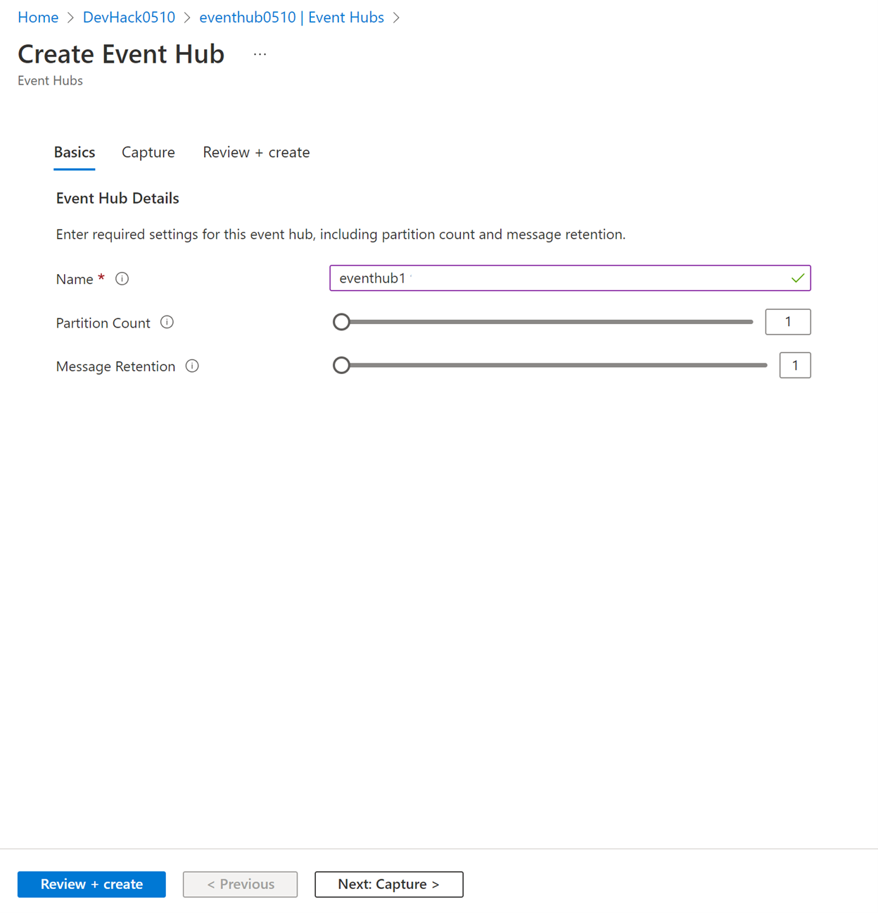

Once created, go to `Event Hub Namespace` page -> `Entities -> Event Hubs` ->  click `event01` -> `+ Consumer group` -> enter Name: `cg01` -> click `Create`.

Once created, you will see:

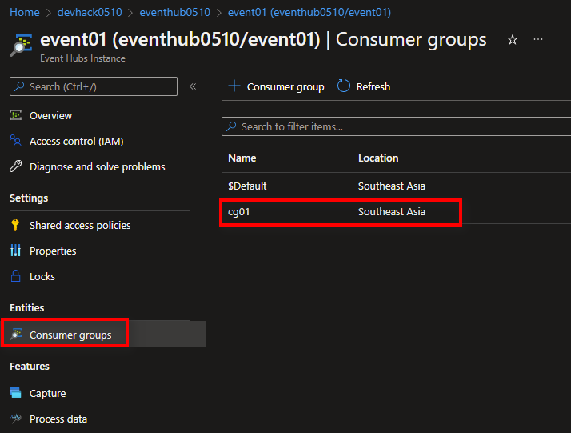

Click `Settings` -> `Shared access policies` -> `+ Add`. On Add SAS Policy blade, enter Policy name: `policy01` -> tick `Manaage` -> click `Create`.

Once created, the policy will be listed.

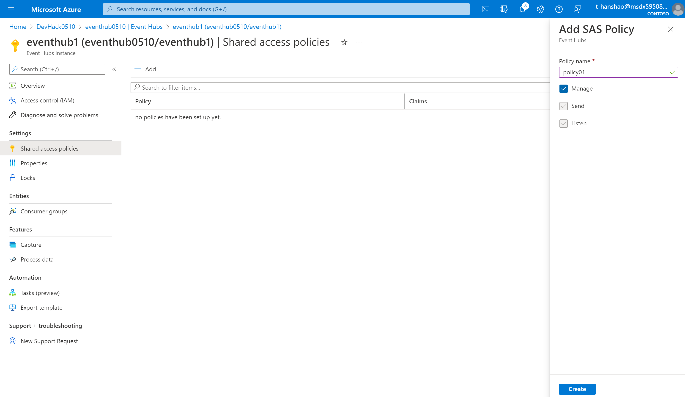
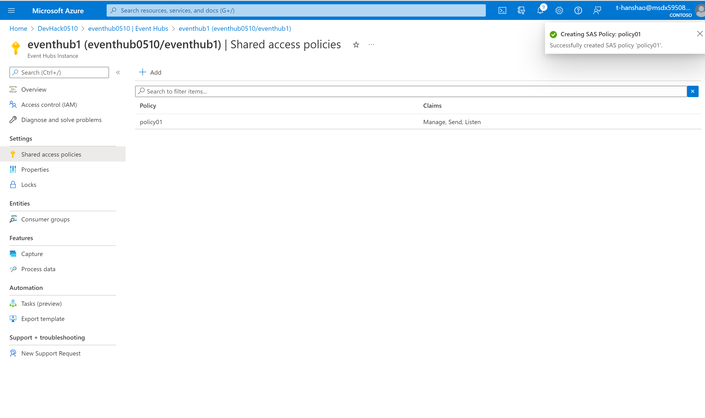

### 3.2 Create new custom endpoint

Go to IoT Hub -> `Messaging` -> `Message routing` -> `Custom endpoints` -> `+ Add` -> `Event hubs` -> Endpoint name: `eventhub` -> select existing Event hub namespace: `eventhub0510` -> select existing Event hub instance: `event01` -> click `Create`.

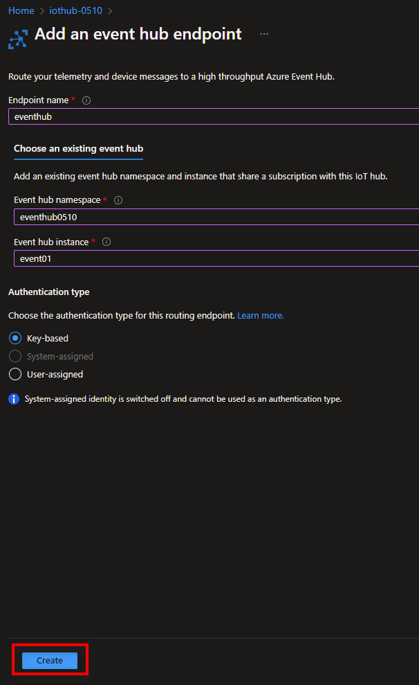

Once created, you will see endpoints listed.

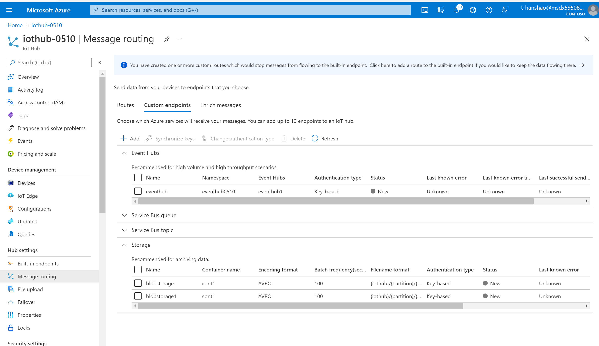

### 3.3 Create new route

Click `Routes` -> `+ Add` -> enter Name: `route2tsi` -> select existing endpoint: `eventhub` -> Data source: `Device Telemetry Messages` ->  click `Save`.

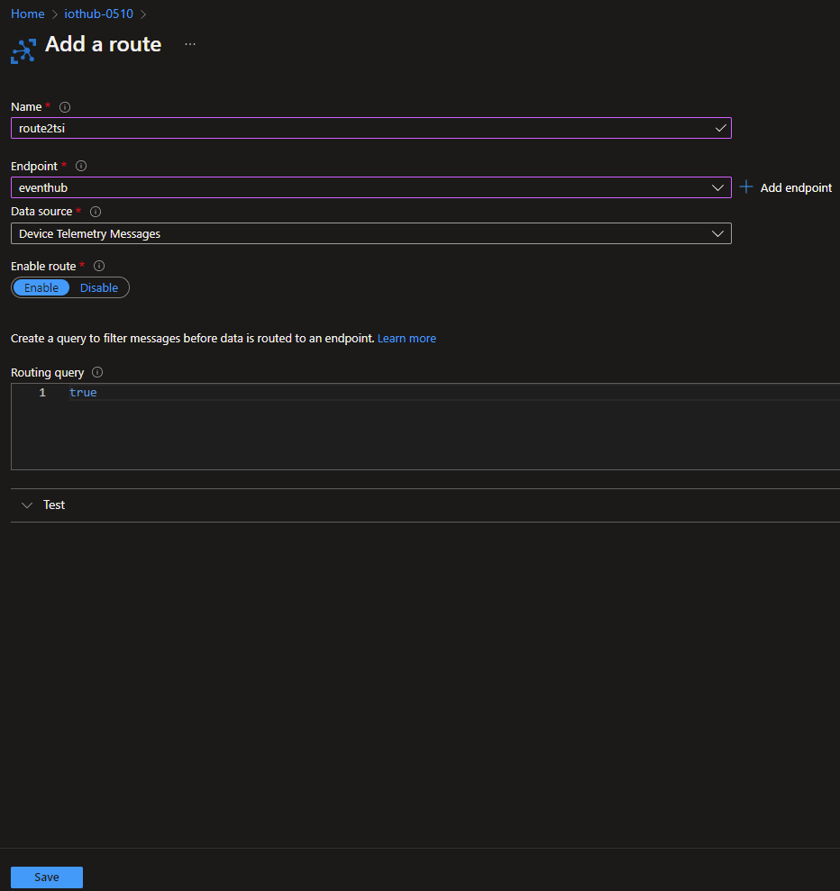

### 3.4 Create TSI Environment

Go back to Azure Portal. Click `+ Create a resource` -> Search `Time Series Insights` -> Click `Create`.

Select the `Resource Group` you created ealier -> enter Environment name: `tsi01` -> location: `Southeast Asia` -> enter Property name: `esp001` -> enter Storage account name: `tsistorage0510` -> click `Next: Event Source`.

On `Event Source` blade -> Source type: `Event Hub` -> enter a name:`eventhub-src` -> select Subscription -> select existing event hub namespace: `eventhub0510` -> Event hub name: `event01` -> Event Hub access access policy name: `policy01`-> Event Hub consumer group: `cg01` -> click `Review + Create`.

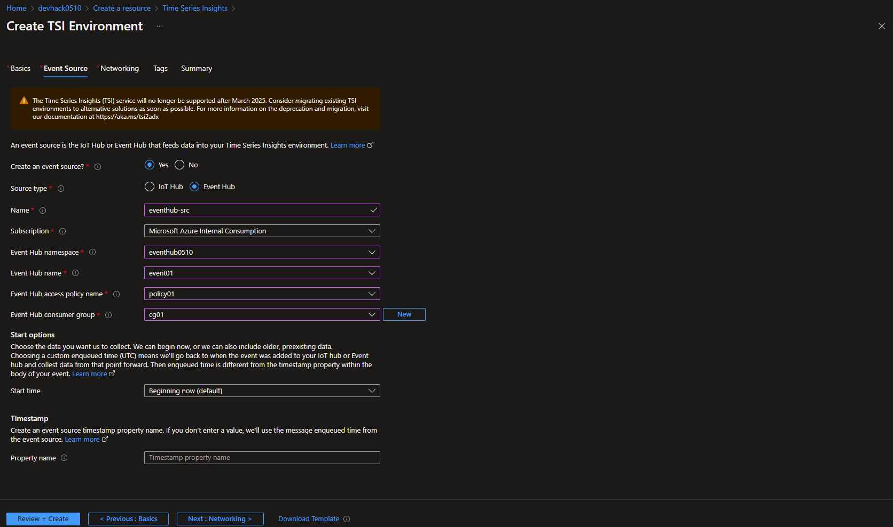

### 3.4 View data on TSI Explorer

Once deployment is completed, click `Go to resource` to TSI Environment. You will see the Ingress Recived messages, Ingress Received Bytes, Property Count, etc, shown as below:

click `Go to TSI Explorer`. The TSI Explorer is opened in a separated window.

If you have multiple TSI instances, you should select the one you created `tsi01` earlier.

#### 3.4.1 Change TSI instance name

Click `Model` -> `Instances` -> `Actions` -> click `Edit instance` -> Enter Name: `esp001` -> `Save`.

#### 3.4.2 Add variables

Click `Analyze` -> `esp001` -> tick `humidity`, `light`, `pressure`,`temperature` -> click `Add`. 

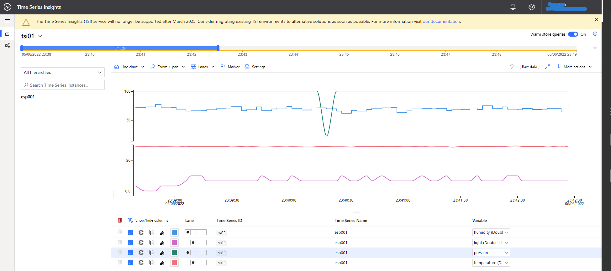

#### 3.4.3 View and export the real-time telemetry data

You may view the data in different line chart, Zoom in/out, view as a table, Connect to Power BI, etc.

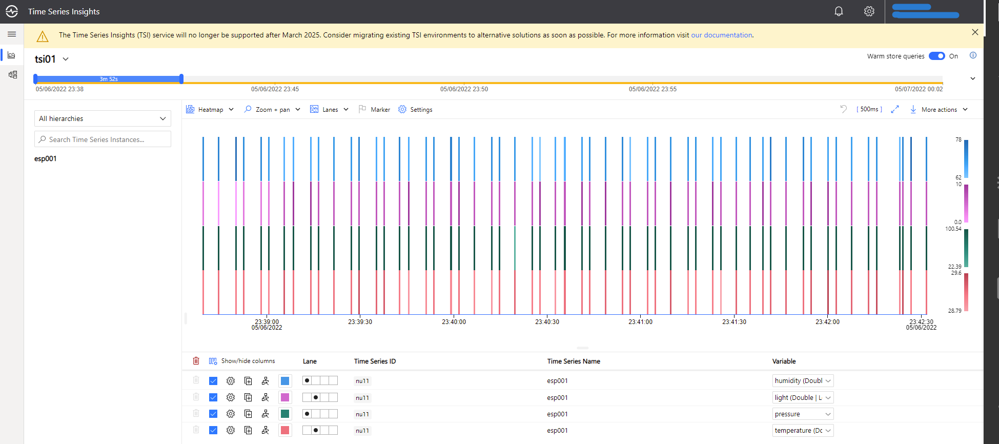

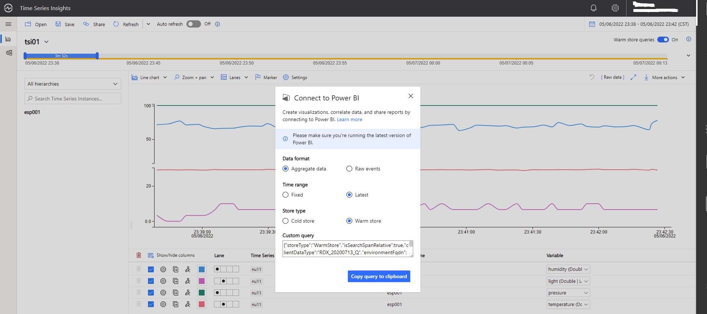

<**END OF Lab2**>

